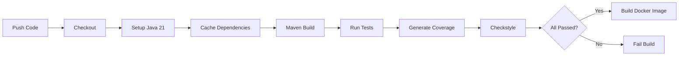
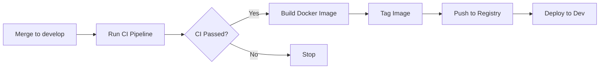

# Quality Management

This document outlines the quality management practices, standards, and processes for the EduMatch project to ensure consistent, high-quality software delivery.

## Table of Contents

- [Definition of Done (DoD)](#definition-of-done-dod)
- [API Conventions](#api-conventions)
- [CI/CD Pipeline](#cicd-pipeline)
- [Testing Standards](#testing-standards)
- [Code Quality Standards](#code-quality-standards)

---

## Definition of Done (DoD)

A feature or task is considered **Done** when ALL of the following criteria are met:

### 1. Code Review ✅
- **Peer Review Required**: Code must be reviewed via GitHub Pull Request by at least one team member
- **PR Template Completed**: All checklist items in the PR template must be addressed
- **Approval Obtained**: PR must be approved before merging
- **No Unresolved Comments**: All review comments must be resolved or addressed

### 2. Unit Tests Passed ✅
- **Minimum Coverage**: 80% code coverage for core business logic
- **All Tests Pass**: No failing tests in the test suite
- **Coverage Report**: JaCoCo coverage report generated and reviewed
- **Test Quality**: Tests follow naming conventions and best practices (see [Testing Standards](#testing-standards))

### 3. Code Quality Checks ✅
- **Checkstyle Validation**: Code passes Google Java Style checkstyle validation
- **No Critical Issues**: No critical or high-severity issues from static analysis
- **Clean Code**: Code follows SOLID principles and clean code practices

### 4. Deployment to Dev Environment ✅
- **Successful Deployment**: Feature deployed to Development environment
- **No Deployment Errors**: Deployment completes without errors
- **Service Health**: Service health checks pass after deployment
- **Docker Image Built**: Docker image successfully built and tagged

### 5. User Acceptance Testing (UAT) ✅
- **Product Owner Approval**: Feature tested and approved by Product Owner
- **Acceptance Criteria Met**: All acceptance criteria from user story are satisfied
- **No Critical Bugs**: No critical or blocking bugs found during UAT
- **Documentation Updated**: User-facing documentation updated if needed

### 6. API Standards Compliance ✅
- **RESTful Conventions**: API follows RESTful standards (see [API Conventions](#api-conventions))
- **Standardized Errors**: Error responses follow standardized format
- **Proper Status Codes**: Correct HTTP status codes used (200, 201, 400, 500, etc.)
- **API Documentation**: Swagger/OpenAPI documentation updated

---

## API Conventions

EduMatch follows RESTful API standards to ensure consistency across all microservices.

### HTTP Status Codes

| Status Code | Usage | Description |
|-------------|-------|-------------|
| **200 OK** | GET, PUT, PATCH | Successful request with response body |
| **201 Created** | POST | Resource successfully created |
| **204 No Content** | DELETE | Successful deletion with no response body |
| **400 Bad Request** | Any | Client error - invalid request data |
| **401 Unauthorized** | Any | Authentication required or failed |
| **403 Forbidden** | Any | Authenticated but insufficient permissions |
| **404 Not Found** | Any | Resource does not exist |
| **409 Conflict** | POST, PUT | Resource conflict (e.g., duplicate) |
| **422 Unprocessable Entity** | POST, PUT | Validation failed |
| **500 Internal Server Error** | Any | Server error - unexpected condition |

### Standardized Error Response Format

All error responses must follow this structure:

```json
{
  "timestamp": "2025-12-05T20:43:56+07:00",
  "status": 400,
  "error": "Bad Request",
  "message": "Validation failed for scholarship application",
  "path": "/api/v1/scholarships/apply",
  "errors": [
    {
      "field": "gpa",
      "message": "GPA must be between 0.0 and 4.0"
    },
    { 
      "field": "email",
      "message": "Invalid email format"
    }
  ]
}
```

**Fields:**
- `timestamp`: ISO 8601 timestamp when error occurred
- `status`: HTTP status code
- `error`: HTTP status text
- `message`: Human-readable error message
- `path`: Request path that caused the error
- `errors`: Array of field-level validation errors (optional)

### RESTful Endpoint Patterns

```
GET    /api/v1/scholarships           # List all scholarships
GET    /api/v1/scholarships/{id}      # Get specific scholarship
POST   /api/v1/scholarships           # Create new scholarship
PUT    /api/v1/scholarships/{id}      # Update entire scholarship
PATCH  /api/v1/scholarships/{id}      # Partial update scholarship
DELETE /api/v1/scholarships/{id}      # Delete scholarship
```

### Request/Response Guidelines

1. **Use JSON**: All requests and responses use `application/json`
2. **camelCase**: Use camelCase for JSON property names
3. **Pagination**: Use query parameters `page`, `size`, `sort`
4. **Filtering**: Use query parameters for filtering (e.g., `?status=active`)
5. **Versioning**: Include API version in path (e.g., `/api/v1/`)

---

## CI/CD Pipeline

### Continuous Integration (CI)

Triggered on **every push** to any branch:



**CI Steps:**
1. **Checkout Code**: Clone repository
2. **Setup Java 21**: Configure Java environment
3. **Cache Maven Dependencies**: Speed up builds
4. **Maven Build**: Compile code (`mvn clean compile`)
5. **Run Unit Tests**: Execute test suite (`mvn test`)
6. **Generate Coverage Report**: JaCoCo coverage analysis
7. **Enforce Coverage**: Fail if below 80% threshold
8. **Checkstyle Validation**: Google Java Style compliance
9. **Build Docker Image**: Create container image (if all pass)

### Continuous Deployment (CD)

Triggered on **merge to `develop` branch**:



**CD Steps:**
1. **Run Full CI Pipeline**: All CI checks must pass
2. **Build Docker Image**: Create production-ready image
3. **Tag Image**: Tag with commit SHA and branch name
4. **Push to Container Registry**: Upload to Docker registry
5. **Deploy to Dev Environment**: Automatic deployment to dev server

### Environment Strategy

| Environment | Branch | Deployment | Purpose |
|-------------|--------|------------|---------|
| **Development** | `develop` | Automatic | Integration testing, QA |
| **Staging** | `main` | Manual | UAT, pre-production testing |
| **Production** | `main` | Manual | Live production environment |

---

## Testing Standards

### Unit Testing Requirements

1. **Coverage Minimum**: 80% code coverage for core business logic
2. **Test Framework**: JUnit 5 (Jupiter)
3. **Mocking**: Mockito for dependencies
4. **Test Data**: Instancio for generating test data

### Test Naming Convention

```java
@Test
void methodName_scenario_expectedBehavior() {
    // Given
    // When
    // Then
}
```

**Example:**
```java
@Test
void applyForScholarship_whenEligible_shouldCreateApplication() {
    // Given
    Student student = createEligibleStudent();
    Scholarship scholarship = createActiveScholarship();
    
    // When
    Application result = scholarshipService.apply(student, scholarship);
    
    // Then
    assertNotNull(result);
    assertEquals(ApplicationStatus.PENDING, result.getStatus());
}
```

### Test Organization

```
src/
├── main/java/com/minh/scholarship/
│   ├── service/
│   │   └── ScholarshipService.java
│   └── repository/
│       └── ScholarshipRepository.java
└── test/java/com/minh/scholarship/
    ├── service/
    │   └── ScholarshipServiceTest.java
    └── repository/
        └── ScholarshipRepositoryTest.java
```

### What to Test

✅ **DO Test:**
- Business logic and calculations
- Validation rules
- Service layer methods
- Repository queries
- Exception handling
- Edge cases and boundary conditions

❌ **DON'T Test:**
- Simple getters/setters
- Framework code (Spring, JPA)
- Third-party libraries
- Configuration classes

### Integration Testing

Use **Testcontainers** for integration tests requiring:
- Database (PostgreSQL)
- Message broker (Kafka)
- External services (Keycloak)

```java
@Testcontainers
@SpringBootTest
class ScholarshipIntegrationTest {
    
    @Container
    static PostgreSQLContainer<?> postgres = new PostgreSQLContainer<>("postgres:15");
    
    @Test
    void shouldPersistScholarship() {
        // Integration test with real database
    }
}
```

---

## Code Quality Standards

### Checkstyle Configuration

EduMatch uses **Google Java Style Guide** enforced via Checkstyle.

**Configuration**: `checkstyle/checkstyle.xml`

**Key Rules:**
- **Line Length**: Maximum 120 characters
- **Indentation**: 4 spaces (no tabs)
- **Naming Conventions**:
  - Classes: `PascalCase`
  - Methods: `camelCase`
  - Constants: `UPPER_SNAKE_CASE`
  - Packages: `lowercase`
- **Javadoc**: Required for public classes and methods
- **Import Order**: Static imports first, then third-party, then project

### Code Review Guidelines

**Reviewers should check for:**

1. **Functionality**: Does the code work as intended?
2. **Tests**: Are there adequate tests with good coverage?
3. **Readability**: Is the code easy to understand?
4. **Design**: Does it follow SOLID principles?
5. **Security**: Are there any security vulnerabilities?
6. **Performance**: Are there obvious performance issues?
7. **Documentation**: Is complex logic documented?

### Pull Request Best Practices

1. **Small PRs**: Keep PRs focused and under 400 lines when possible
2. **Descriptive Title**: Clear, concise description of changes
3. **Link Issues**: Reference related issues/tickets
4. **Self-Review**: Review your own code before requesting review
5. **Respond Promptly**: Address review comments quickly
6. **Clean History**: Squash commits if needed before merging

---

## Quality Metrics

### Key Performance Indicators (KPIs)

| Metric | Target | Measurement |
|--------|--------|-------------|
| **Code Coverage** | ≥ 80% | JaCoCo reports |
| **Build Success Rate** | ≥ 95% | GitHub Actions |
| **Checkstyle Compliance** | 100% | Checkstyle validation |
| **PR Review Time** | < 24 hours | GitHub metrics |
| **Deployment Frequency** | Daily | CD pipeline |
| **Mean Time to Recovery** | < 1 hour | Incident tracking |

### Monitoring and Reporting

- **Coverage Reports**: Generated on every build, available in `target/site/jacoco/`
- **Checkstyle Reports**: Available in `target/checkstyle-result.xml`
- **Build Status**: Visible on GitHub Actions dashboard
- **Quality Dashboard**: Track metrics over time

---

## Resources

- [API Conventions Guide](./API_CONVENTIONS.md)
- [Testing Guide](./TESTING_GUIDE.md)
- [Google Java Style Guide](https://google.github.io/styleguide/javaguide.html)
- [JaCoCo Documentation](https://www.jacoco.org/jacoco/trunk/doc/)
- [Checkstyle Documentation](https://checkstyle.org/)

---

**Last Updated**: 2025-12-05  
**Version**: 1.0
